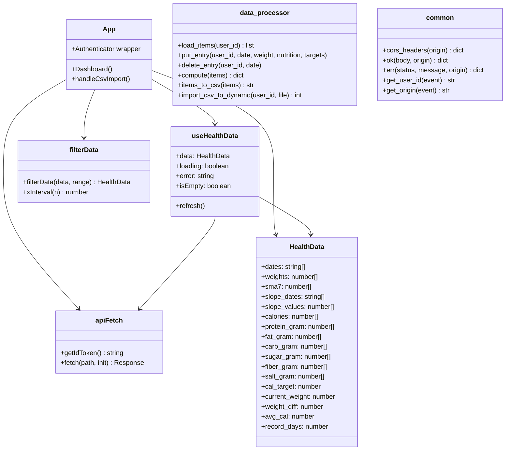

# Code Structure

## Build System

| 層 | ツール | 主要設定ファイル |
|---|---|---|
| フロントエンド | npm + Vite + TypeScript | `package.json` / `tsconfig.json` / `vite.config.ts` |
| バックエンド | pip | `backend/requirements.txt` |
| インフラ | npm + AWS CDK | `infrastructure/package.json` / `infrastructure/tsconfig.json` / `infrastructure/cdk.json` |

## Key Classes/Modules

## File Inventory

**フロントエンド (src/)**
- `src/main.tsx` — Amplify.configure() + Authenticator.Provider マウントポイント
- `src/App.tsx` — ルートコンポーネント。Authenticator ラップ + Dashboard 実装（データ取得・フィルター・CSV 操作）
- `src/aws-config.ts` — Amplify / Cognito / API エンドポイント設定（VITE_* 環境変数を読み込む）
- `src/types.ts` — HealthData インターフェース定義（TypeScript）
- `src/vite-env.d.ts` — `import.meta.env` 型定義（Vite 用）
- `src/index.css` — グローバルスタイル
- `src/hooks/useHealthData.ts` — API フェッチカスタムフック。Cognito JWT 取得 + `/api/data` 呼び出し
- `src/utils/filterData.ts` — 期間フィルター（RangeDays ごとのスライス）と X 軸間隔計算
- `src/utils/dateFormat.ts` — グラフ軸ラベル用日付フォーマッター
- `src/components/StatCard.tsx` — サマリーカード（最新体重・平均カロリー・表示期間）
- `src/components/RangeFilter.tsx` — 期間切り替えボタン群（30/90/180/365/全期間）
- `src/components/EntryForm.tsx` — 体重・体脂肪率・食事データ入力/編集/削除モーダル
- `src/components/WeightChart.tsx` — 体重推移折れ線グラフ（SMA7・Brush 付き、Recharts）
- `src/components/BodyFatChart.tsx` — 体脂肪率折れ線グラフ（SMA7・Brush 付き、Recharts）
- `src/components/SlopeChart.tsx` — 週次増減ペース棒グラフ（Recharts）
- `src/components/NutrientChart.tsx` — 栄養素棒グラフ（目安ライン付き、Recharts）
- `src/components/EmptyState.tsx` — データなし・エラー状態表示

**バックエンド (backend/)**
- `backend/common.py` — CORS ヘッダー生成・レスポンスヘルパー（ok/err）・get_user_id・get_origin
- `backend/data_processor.py` — DynamoDB CRUD + 集計ロジック（compute / put_entry / delete_entry / items_to_csv / import_csv_to_dynamo）
- `backend/lambda/data.py` — GET /api/data ハンドラー
- `backend/lambda/entry.py` — POST/DELETE /api/entry ハンドラー
- `backend/lambda/export.py` — GET /api/export ハンドラー
- `backend/lambda/import_csv.py` — POST /api/import ハンドラー
- `backend/requirements.txt` — boto3 / numpy / pandas（バージョンは [technology-stack.md](technology-stack.md) 参照）

**インフラ (infrastructure/)**
- `infrastructure/bin/app.ts` — CDK エントリポイント（HealthDashboardStack インスタンス化）
- `infrastructure/lib/stack.ts` — HealthDashboardStack 定義（全 AWS リソース）
- `infrastructure/cdk.json` — CDK 設定ファイル

**スクリプト (scripts/)**
- `scripts/generate_dummy.py` — DynamoDB Local にダミーデータ投入
- `scripts/generate_dummy_csv.py` — Web UI インポート用ダミー CSV 生成
- `scripts/migrate_csv_to_dynamodb.py` — 旧 CSV → DynamoDB 移行ツール

**ルート**
- `index.html` / `vite.config.ts` / `package.json` / `tsconfig.json` — フロントエンドビルド設定
- `docker-compose.yml` — DynamoDB Local + dynamodb-admin（ローカル開発用）
- `.env.local.example` — ローカル開発用 VITE_* 変数テンプレート
- `amplify.yml` — Amplify ビルド設定（`infrastructure/lib/stack.ts` の buildSpec と二重管理）

## Design Patterns

### Serverless Handler Pattern
- **Location**: `backend/lambda/*.py`
- **Purpose**: 各 Lambda ハンドラーが共通ユーティリティ（common.py）に委譲し、ビジネスロジックを data_processor.py に集約
- **Implementation**: `handler(event, context)` → `get_user_id()` / `get_origin()` → data_processor 関数

### Custom Hook Pattern
- **Location**: `src/hooks/useHealthData.ts`
- **Purpose**: API 通信・状態管理をコンポーネントから分離。refresh() で再フェッチを実現
- **Implementation**: `useState` + `useEffect` + `version` カウンターによる再実行トリガー

### Target Value Carry-Forward
- **Location**: `backend/data_processor.py` の `put_entry()`
- **Purpose**: 新しいエントリ作成時に直前の目安値（cal_target 等）を自動引き継ぎ
- **Implementation**: existing → last_item の優先順位で target フィールドをフォールバック

### Two-Step CDK Deploy
- **Location**: `infrastructure/lib/stack.ts`
- **Purpose**: Amplify URL が CDK デプロイ前不明なため、Cognito callbackUrls への追加は2回に分けてデプロイ
- **Implementation**: Step1 で AmplifyAppUrl を出力 → Step2 で AMPLIFY_DOMAIN をセットして再デプロイ
