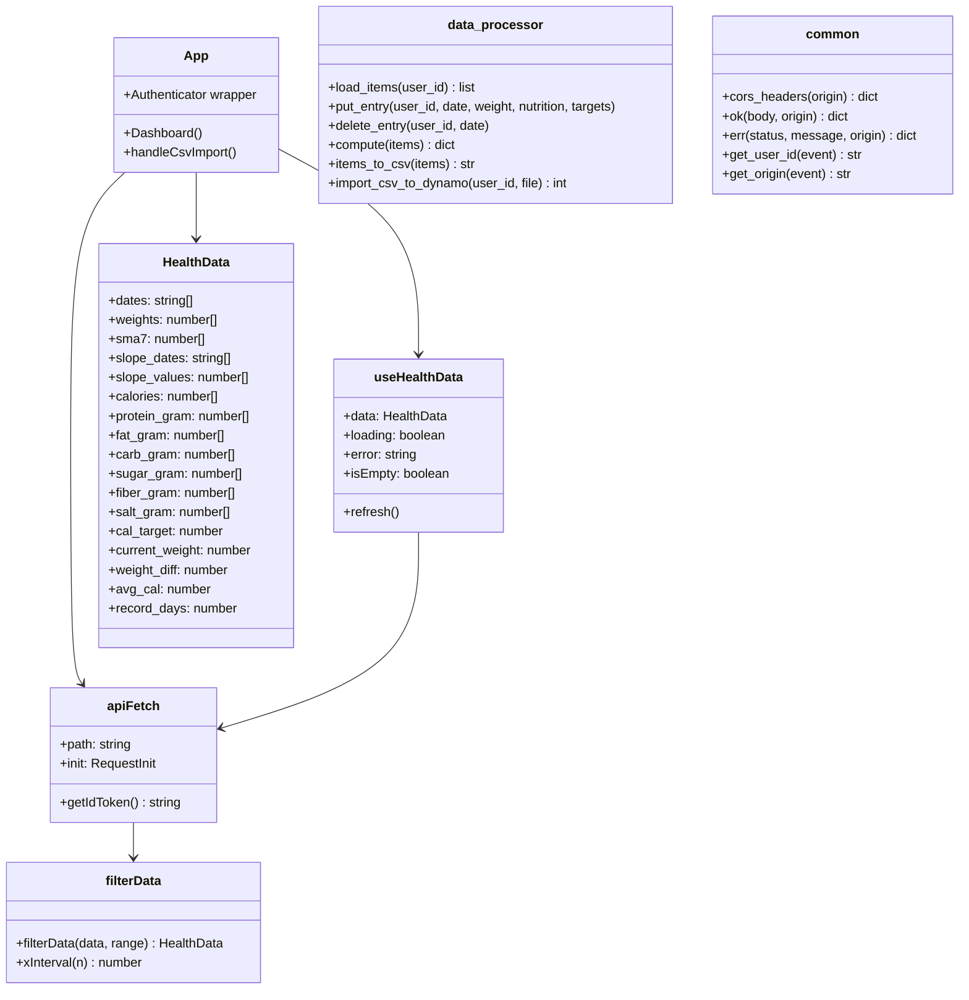

# Code Structure

## Build System

- **Type**: npm (フロントエンド) / pip (バックエンド) / npm + CDK (インフラ)
- **Configuration**:
  - フロントエンド: `package.json` (Vite + TypeScript) / `tsconfig.json` / `vite.config.ts`
  - バックエンド: `backend/requirements.txt` (pip)
  - インフラ: `infrastructure/package.json` / `infrastructure/tsconfig.json` / `infrastructure/cdk.json`

## Key Classes/Modules

### Existing Files Inventory

**フロントエンド (src/)**
- `src/main.tsx` — Amplify.configure() + Authenticator.Provider マウントポイント
- `src/App.tsx` — ルートコンポーネント。Authenticator ラップ + Dashboard 実装（データ取得・フィルター・CSV 操作）
- `src/aws-config.ts` — Amplify / Cognito / API エンドポイント設定（VITE_* 環境変数を読み込む）
- `src/types.ts` — HealthData インターフェース定義（TypeScript）
- `src/vite-env.d.ts` — `import.meta.env` 型定義（Vite 用）
- `src/index.css` — グローバルスタイル（ダッシュボード・チャート・ヘッダー CSS）
- `src/hooks/useHealthData.ts` — API フェッチカスタムフック。Cognito JWT 取得 + `/api/data` 呼び出し
- `src/utils/filterData.ts` — 期間フィルター（RangeDays ごとのスライス）と X 軸間隔計算
- `src/utils/dateFormat.ts` — グラフ軸ラベル用日付フォーマッター
- `src/components/StatCard.tsx` — サマリーカード（最新体重・平均カロリー・表示期間）
- `src/components/RangeFilter.tsx` — 期間切り替えボタン群（30/90/180/365/全期間）
- `src/components/EntryForm.tsx` — 体重・食事データ入力/編集/削除モーダル
- `src/components/WeightChart.tsx` — 体重推移折れ線グラフ（SMA7・Brush 付き、Recharts）
- `src/components/SlopeChart.tsx` — 週次増減ペース棒グラフ（Recharts）
- `src/components/NutrientChart.tsx` — 栄養素棒グラフ（目安ライン付き、Recharts）
- `src/components/EmptyState.tsx` — データなし・エラー状態表示

**バックエンド (backend/)**
- `backend/common.py` — CORS ヘッダー生成・レスポンスヘルパー（ok/err）・get_user_id・get_origin
- `backend/data_processor.py` — DynamoDB CRUD + 集計ロジック（compute / put_entry / delete_entry / items_to_csv / import_csv_to_dynamo）
- `backend/lambda/data.py` — GET /api/data ハンドラー（load_items + compute）
- `backend/lambda/entry.py` — POST/DELETE /api/entry ハンドラー（put_entry / delete_entry + compute）
- `backend/lambda/export.py` — GET /api/export ハンドラー（load_items + items_to_csv、Base64エンコード）
- `backend/lambda/import_csv.py` — POST /api/import ハンドラー（import_csv_to_dynamo）
- `backend/requirements.txt` — boto3>=1.35 / numpy>=2.0 / pandas>=2.2

**インフラ (infrastructure/)**
- `infrastructure/bin/app.ts` — CDK エントリポイント（HealthDashboardStack インスタンス化）
- `infrastructure/lib/stack.ts` — HealthDashboardStack 定義（全 AWS リソース）
- `infrastructure/cdk.json` — CDK 設定ファイル
- `infrastructure/package.json` — CDK 依存関係
- `infrastructure/tsconfig.json` — TypeScript 設定

**スクリプト (scripts/)**
- `scripts/generate_dummy.py` — DynamoDB Local にダミーデータ投入（boto3直接）
- `scripts/generate_dummy_csv.py` — Web UI インポート用ダミー CSV 生成（pandas）
- `scripts/migrate_csv_to_dynamodb.py` — 旧 CSV → DynamoDB 移行ツール

**ルート**
- `index.html` — Vite エントリ HTML
- `vite.config.ts` — Vite 設定
- `package.json` — フロントエンド依存関係 (React 18 / Recharts / aws-amplify)
- `tsconfig.json` — TypeScript 設定
- `docker-compose.yml` — DynamoDB Local + dynamodb-admin（ローカル開発用）
- `.env.local.example` — ローカル開発用 VITE_* 変数テンプレート
- `amplify.yml` — Amplify ビルド設定（CDK の buildSpec と重複管理）
- `.python-version` — Python バージョン指定（pyenv 用）

## Design Patterns

### Serverless Handler Pattern
- **Location**: `backend/lambda/*.py`
- **Purpose**: 各 Lambda ハンドラーが共通ユーティリティ（common.py）に委譲し、ビジネスロジックを data_processor.py に集約。
- **Implementation**: `handler(event, context)` が `get_user_id()` / `get_origin()` で認証・CORS を処理し、data_processor の関数を呼び出す。

### Custom Hook Pattern
- **Location**: `src/hooks/useHealthData.ts`
- **Purpose**: API 通信・状態管理をコンポーネントから分離。refresh() で再フェッチを実現。
- **Implementation**: `useState` + `useEffect` + `version` カウンターによる再実行トリガー。

### Target Value Carry-Forward
- **Location**: `backend/data_processor.py` の `put_entry()`
- **Purpose**: 新しいエントリ作成時に直前の目安値（cal_target 等）を自動引き継ぎ、毎回入力する手間を省く。
- **Implementation**: existing → last_item の優先順位で target フィールドをフォールバック。

### Two-Step CDK Deploy
- **Location**: `infrastructure/lib/stack.ts` コメント
- **Purpose**: Amplify URL が CDK デプロイ前は不明なため、循環依存を回避するための2ステップデプロイ。
- **Implementation**: Step1 で AmplifyAppUrl を出力 → Step2 で AMPLIFY_DOMAIN 環境変数をセットして再デプロイ。

## Critical Dependencies

### aws-amplify v6.14
- **Version**: ^6.14
- **Usage**: `src/hooks/useHealthData.ts`（fetchAuthSession）/ `src/aws-config.ts`（Amplify.configure）
- **Purpose**: Cognito 認証・ID Token 取得

### @aws-amplify/ui-react v6.6
- **Version**: ^6.6
- **Usage**: `src/App.tsx`（Authenticator, useAuthenticator）
- **Purpose**: Cognito 認証 UI コンポーネント（ログイン画面）

### recharts v2.13
- **Version**: ^2.13.3
- **Usage**: WeightChart / SlopeChart / NutrientChart
- **Purpose**: グラフレンダリング

### pandas v2.2 + numpy v2.0
- **Version**: pandas>=2.2, numpy>=2.0
- **Usage**: `backend/data_processor.py`（compute / import_csv_to_dynamo）
- **Purpose**: 数値計算（SMA / 線形回帰 / CSV パース）。C 拡張を含むため Docker ビルド必須。

### boto3 v1.35
- **Version**: >=1.35
- **Usage**: `backend/data_processor.py`（DynamoDB アクセス）
- **Purpose**: AWS SDK for Python
