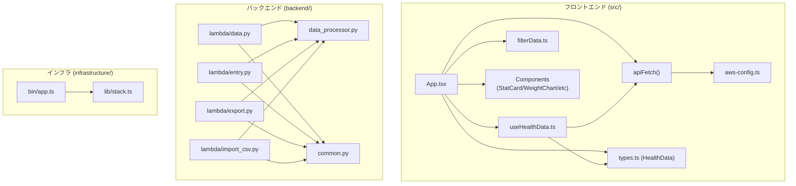
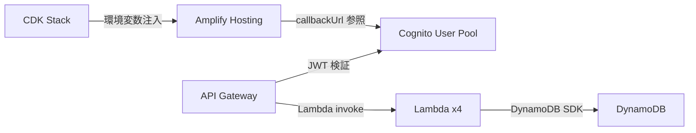

# Dependencies

## Internal Dependencies



Text Alternative:
```
src/App.tsx -> useHealthData, apiFetch, filterData, types, components
src/hooks/useHealthData.ts -> apiFetch, types
src/utils/apiFetch -> aws-config.ts

backend/lambda/data.py -> data_processor.py, common.py
backend/lambda/entry.py -> data_processor.py, common.py
backend/lambda/export.py -> data_processor.py, common.py
backend/lambda/import_csv.py -> data_processor.py, common.py

infrastructure/bin/app.ts -> infrastructure/lib/stack.ts
```

### data_processor.py は backend/ 配下の全 Lambda から参照
- **Type**: Compile-time (Python import)
- **Reason**: DynamoDB CRUD と HealthData 集計ロジックを一元化

### common.py は backend/ 配下の全 Lambda から参照
- **Type**: Compile-time (Python import)
- **Reason**: CORS・認証ユーティリティの共通化

## External Dependencies

### フロントエンド

| ライブラリ | バージョン | 目的 | ライセンス |
|---|---|---|---|
| react | ^18.3.1 | UI フレームワーク | MIT |
| react-dom | ^18.3.1 | DOM レンダリング | MIT |
| aws-amplify | ^6.14 | Cognito 認証 + API クライアント | Apache-2.0 |
| @aws-amplify/ui-react | ^6.6 | Authenticator UI コンポーネント | Apache-2.0 |
| recharts | ^2.13.3 | グラフライブラリ | MIT |
| vite | ^6.0.1 | ビルドツール (devDependency) | MIT |
| typescript | ^5.6.3 | 型チェック (devDependency) | Apache-2.0 |
| @vitejs/plugin-react | ^4.3.3 | Vite React プラグイン (devDependency) | MIT |

### バックエンド (Lambda)

| ライブラリ | バージョン | 目的 | ライセンス |
|---|---|---|---|
| boto3 | >=1.35 | AWS SDK for Python (DynamoDB アクセス) | Apache-2.0 |
| pandas | >=2.2 | データフレーム処理・CSV パース・線形回帰 | BSD-3-Clause |
| numpy | >=2.0 | 数値計算（polyfit・rolling 計算） | BSD-3-Clause |

**注意**: pandas / numpy は C 拡張を含むため、CDK デプロイ時に Docker（SAM ビルドイメージ）でビルドする必要がある。Lambda アーキテクチャが ARM_64 のため Apple Silicon Mac 上で直接ビルド可能。

### インフラ (CDK)

| ライブラリ | バージョン | 目的 | ライセンス |
|---|---|---|---|
| aws-cdk-lib | (latest) | CDK コンストラクトライブラリ | Apache-2.0 |
| constructs | (latest) | CDK Construct ベースクラス | Apache-2.0 |

## AWS サービス依存関係



Text Alternative:
```
Amplify Hosting -> Cognito (callbackUrl)
API Gateway -> Cognito (JWT検証)
API Gateway -> Lambda x4 (invoke)
Lambda x4 -> DynamoDB (SDK)
CDK -> Amplify (VITE_* 環境変数注入)
```

**注意事項**: Amplify URL が CDK デプロイ前は不明なため、Cognito callbackUrls への追加は2ステップデプロイが必要（循環依存回避）。
