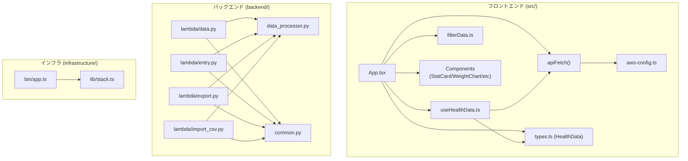
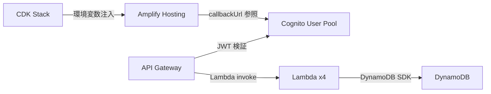

# Dependencies

ライブラリのバージョン・用途詳細は [technology-stack.md](technology-stack.md) を参照。
本ファイルは**依存関係グラフ**（内部構造・AWSサービス間）を管理する。

## Internal Dependencies



Text Alternative:
```
src/App.tsx          -> useHealthData, apiFetch, filterData, types, components
src/useHealthData.ts -> apiFetch, types
src/apiFetch         -> aws-config.ts

backend/lambda/data.py       -> data_processor.py, common.py
backend/lambda/entry.py      -> data_processor.py, common.py
backend/lambda/export.py     -> data_processor.py, common.py
backend/lambda/import_csv.py -> data_processor.py, common.py

infrastructure/bin/app.ts -> infrastructure/lib/stack.ts
```

**data_processor.py**: 全 Lambda から参照。DynamoDB CRUD + HealthData 集計ロジックの一元化。  
**common.py**: 全 Lambda から参照。CORS・認証ユーティリティの共通化。

## AWS サービス依存関係



Text Alternative:
```
Amplify Hosting -> Cognito (callbackUrl)
API Gateway     -> Cognito (JWT 検証)
API Gateway     -> Lambda x4 (invoke)
Lambda x4       -> DynamoDB (boto3 SDK)
CDK Stack       -> Amplify (VITE_* 環境変数注入)
```

**注意**: Amplify URL が CDK デプロイ前に不明なため、Cognito callbackUrls への追加は2ステップデプロイが必要（循環依存回避）。
