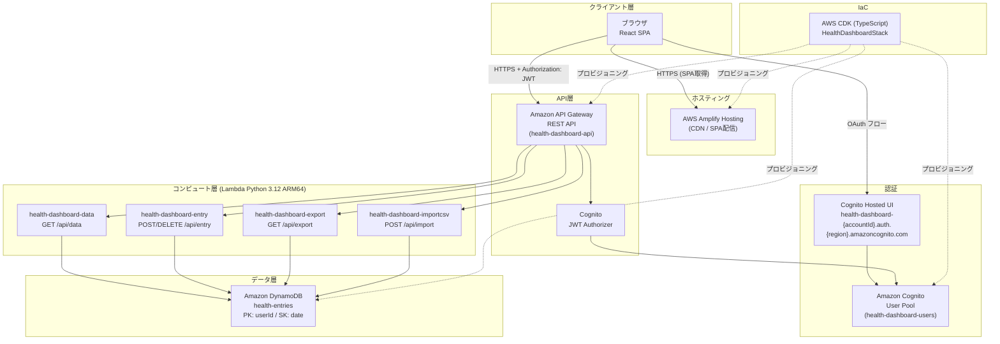
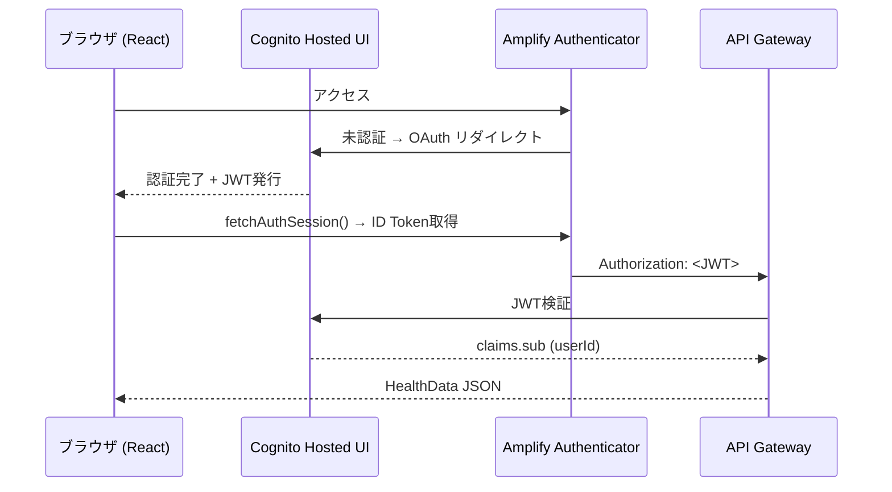
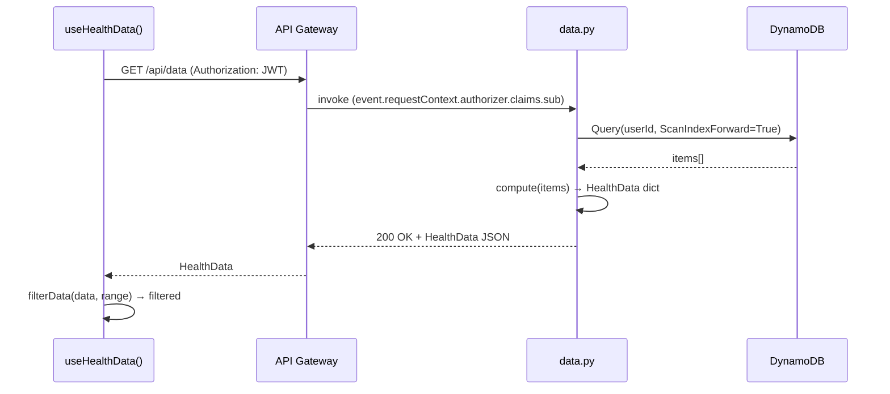

# System Architecture

## System Overview

個人用健康管理ダッシュボード（AWS 版）。React SPA + AWS Serverless のフルスタック構成。AWS Amplify Hosting で SPA を配信し、Amazon API Gateway + AWS Lambda でバックエンド API を提供。データは Amazon DynamoDB に永続化。認証は Amazon Cognito User Pool で管理し、API Gateway に Cognito JWT Authorizer を配置してエンドポイントを保護する。全インフラは AWS CDK（TypeScript）で IaC 管理。

## Architecture Diagram



Text Alternative:
```
[ブラウザ] --HTTPS SPA取得--> [Amplify Hosting]
[ブラウザ] --OAuth フロー--> [Cognito Hosted UI] --> [Cognito User Pool]
[ブラウザ] --HTTPS + JWT--> [API Gateway]
[API Gateway] --JWT検証--> [Cognito Authorizer] --> [Cognito]
[API Gateway] --> [Lambda: data / entry / export / import]
[Lambda x4] --> [DynamoDB: health-entries]
[CDK] --プロビジョニング--> [全AWSリソース]
```

## Component Descriptions

### src/ — React SPA フロントエンド
- **Purpose**: ユーザーインターフェース。Cognito 認証・データ入力・グラフ可視化・CSV 操作を提供。
- **Responsibilities**: Amplify UI Authenticator による認証フロー、JWT 付き API リクエスト、HealthData フィルタリング、Recharts グラフレンダリング。
- **Dependencies**: AWS Amplify (aws-amplify, @aws-amplify/ui-react), React 18, Recharts。
- **Type**: Application

### backend/ — Lambda バックエンド
- **Purpose**: API ビジネスロジック。DynamoDB CRUD・データ集計・CSV 変換を提供。
- **Responsibilities**: ユーザー認証（JWT sub 抽出）、DynamoDB の読み書き、compute() による HealthData 生成、CSV エクスポート/インポート。
- **Dependencies**: boto3, pandas, numpy。Lambda ランタイム: Python 3.12 ARM_64。
- **Type**: Application

### infrastructure/ — AWS CDK スタック
- **Purpose**: 全 AWS リソースの IaC 定義。
- **Responsibilities**: DynamoDB / Lambda / API Gateway / Cognito / Amplify Hosting のプロビジョニング。Amplify への環境変数注入。GitHub PAT による Amplify-GitHub 連携。
- **Dependencies**: aws-cdk-lib, constructs。
- **Type**: Infrastructure

### scripts/ — 運用補助スクリプト
- **Purpose**: 開発・データ移行用スクリプト群。
- **Responsibilities**: DynamoDB Local へのダミーデータ投入、CSV ダミーデータ生成、旧 CSV からの DynamoDB 移行。
- **Dependencies**: boto3, pandas, numpy。
- **Type**: Utility

## Data Flow

### 認証フロー



### データ取得フロー



## Integration Points

- **External APIs**: なし（外部 API との直接統合なし）
- **Databases**: Amazon DynamoDB (`health-entries` テーブル、オンデマンドキャパシティ)
- **Third-party Services**:
  - GitHub（Amplify Hosting の CI/CD ソース。PAT で連携）
  - Google / Apple / Facebook / Amazon（SNS IdP。現在コメントアウト、設定時に有効化）

## Infrastructure Components

- **CDK Stacks**: `HealthDashboardStack` — 全リソースを単一スタックで管理
- **Deployment Model**: AWS Amplify Hosting（SPA）+ Serverless（Lambda + API Gateway）。GitHub push で自動ビルド＆デプロイ。
- **Networking**: VPC なし（全リソースがマネージドサービス）。CORS は API Gateway で allowOrigins: * に設定。
