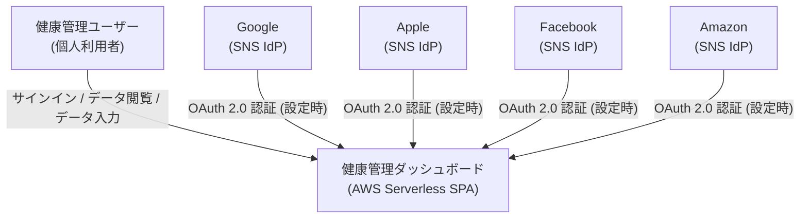

# Business Overview

## Business Context Diagram



Text Alternative:
```
[健康管理ユーザー] --サインイン/データ操作--> [健康管理ダッシュボード]
[Google/Apple/Facebook/Amazon IdP] --OAuth認証(オプション)--> [健康管理ダッシュボード]
```

## Business Description

- **Business Description**: 個人ユーザーが日々の体重・食事データを記録・可視化し、健康トレンドを把握するための個人用 Web アプリケーション。AWS Serverless アーキテクチャ（Amplify Hosting + Cognito + API Gateway + Lambda + DynamoDB）上で動作し、マルチユーザー対応。Cognito 認証によりデータはユーザーごとに完全に分離される。

- **Business Transactions**:
  1. **ユーザー認証**: Cognito Hosted UI を通じたメール/パスワード認証。SNS IdP（Google / Apple / Facebook / Amazon）連携はオプションで設定可能。管理者のみがユーザー作成可能（セルフサインアップ無効）。
  2. **健康データ取得・表示**: ログイン後、全期間の体重・栄養素データを API から取得してダッシュボードに表示。期間フィルター（30日 / 90日 / 半年 / 1年 / 全期間）で表示範囲を絞り込み。
  3. **体重・食事データ入力**: Web UI からモーダルフォームで日付単位のデータを追加・編集・削除。
  4. **体重トレンド分析**: 7日単純移動平均（SMA）と30日線形回帰による週次増減ペースを自動計算・グラフ表示。
  5. **CSV エクスポート**: 全データを UTF-8 BOM 付き CSV としてダウンロード。
  6. **CSV インポート**: 旧システム（Render 版など）や他ツールからのデータ移行。日本語カラム名の CSV を一括インポート。

- **Business Dictionary**:
  - **SMA7**: 7日単純移動平均。直近7日の体重平均値。短期ノイズを除去してトレンドを可視化する。
  - **傾き（Slope）**: 直近30日の体重データに線形回帰を当てはめた1日あたりの変化量（kg/日）。週次サンプリングして棒グラフ表示。
  - **userId**: Cognito の sub（UUID）。DynamoDB のパーティションキーとして使用しユーザーを識別。
  - **目安値（Target）**: カロリー・栄養素の目標摂取量。最後の非欠損値が新規エントリに自動引き継がれる。
  - **HealthData**: バックエンドが compute() で生成する React 向け集計 dict。全グラフ・サマリーの元データ。

## Component Level Business Descriptions

### src/ (React フロントエンド)
- **Purpose**: ユーザーインターフェース。認証・データ入力・グラフ可視化・CSV 操作を提供する SPA。
- **Responsibilities**: Cognito 認証フロー管理、API との通信（JWT 付与）、データフィルタリング・グラフレンダリング。

### backend/ (Lambda バックエンド)
- **Purpose**: データの永続化・集計・エクスポート/インポートを担う API サーバーレスロジック。
- **Responsibilities**: DynamoDB の CRUD、compute() による HealthData 生成、CSV 変換、CORS・認証ユーティリティ。

### infrastructure/ (AWS CDK)
- **Purpose**: AWS 全リソース（DynamoDB / Lambda / API Gateway / Cognito / Amplify）の IaC 定義。
- **Responsibilities**: インフラプロビジョニング、環境変数の Amplify への自動注入、Cognito callback URL の管理。

### scripts/ (運用スクリプト)
- **Purpose**: 開発・データ移行の補助ツール群。
- **Responsibilities**: DynamoDB Local へのダミーデータ投入、CSV ダミーデータ生成、旧システムからの CSV 移行。
