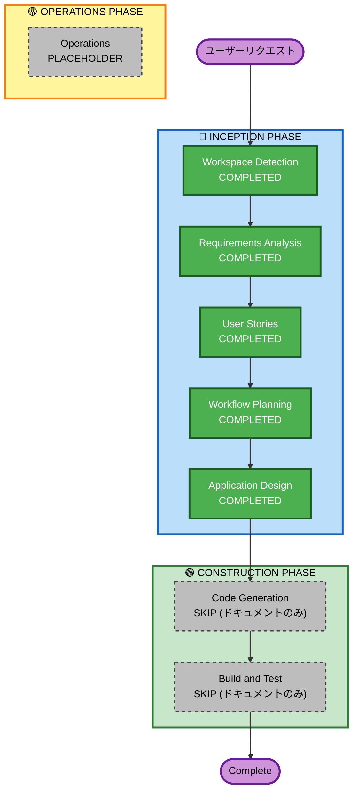

# Execution Plan

## Detailed Analysis Summary

### Transformation Scope
- **Transformation Type**: ドキュメント整備（Brownfield / 既存システムの可視化）
- **Primary Changes**: AI-DLC 準拠ドキュメント一式の生成
- **Related Components**: 全コンポーネント（フロントエンド / バックエンド / インフラ）

### Change Impact Assessment
- **User-facing changes**: No — ドキュメントのみ、アプリケーション動作に変更なし
- **Structural changes**: No
- **Data model changes**: No
- **API changes**: No
- **NFR impact**: No（ドキュメント整備は機能的 NFR に影響しない）

### Risk Assessment
- **Risk Level**: Low
- **Rollback Complexity**: Easy（ドキュメントファイルの削除のみ）
- **Testing Complexity**: Simple（ドキュメントの内容確認のみ）

---

## Workflow Visualization



Text Alternative:
```
[INCEPTION PHASE]
  Workspace Detection   --> COMPLETED
  Requirements Analysis --> COMPLETED
  User Stories          --> COMPLETED
  Workflow Planning     --> COMPLETED
  Application Design    --> COMPLETED

[CONSTRUCTION PHASE]
  Code Generation       --> SKIP (ドキュメント整備のみ)
  Build and Test        --> SKIP (ドキュメント整備のみ)

[OPERATIONS PHASE]
  Operations            --> PLACEHOLDER
```

---

## Phases to Execute

### 🔵 INCEPTION PHASE
- [x] Workspace Detection (COMPLETED)
- [x] Existing System Analysis (COMPLETED) — brownfield 分析ドキュメント生成
- [x] Requirements Analysis (COMPLETED)
- [x] User Stories (COMPLETED)
- [x] Workflow Planning (COMPLETED)
- [x] Application Design (COMPLETED)
- [ ] Units Generation — SKIP
  - **Rationale**: ドキュメント整備のみでコード生成は対象外

### 🟢 CONSTRUCTION PHASE
- [ ] Functional Design — SKIP
  - **Rationale**: 今回はドキュメント整備のみ。将来の機能追加時に実行
- [ ] NFR Requirements — SKIP
  - **Rationale**: 同上
- [ ] NFR Design — SKIP
  - **Rationale**: 同上
- [ ] Infrastructure Design — SKIP
  - **Rationale**: 同上
- [ ] Code Generation — SKIP
  - **Rationale**: 既存コードへの変更なし
- [ ] Build and Test — SKIP
  - **Rationale**: コード変更がないためビルド・テスト不要

### 🟡 OPERATIONS PHASE
- [ ] Operations — PLACEHOLDER

---

## Success Criteria

- **Primary Goal**: AI-DLC に準拠した inception / construction ドキュメント一式の整備
- **Key Deliverables**:
  - inception/: requirements, user-stories, application-design, plans（本ファイル）
  - construction/: code-structure, api-documentation, technology-stack, dependencies, code-quality-assessment
- **Quality Gates**: 各ドキュメントが既存コードと整合している
